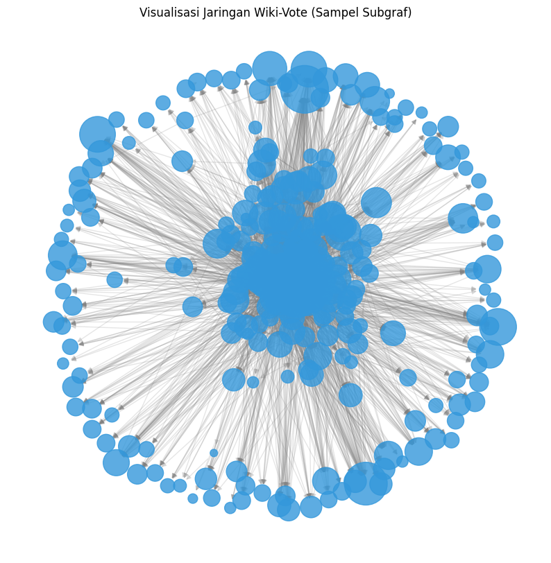

# UAS-Analisis-Jejaring-Sosial
Tugas UAS Untara

## Biodata :
- Nama : Graciela Christy Nunuela
- NIM : 2211310028
- Prodi : Teknologi Informasi
- Dataset : `wiki-Vote.txt.gz`

## Deskripsi Repository
Repository ini berisi berkas analisis Social Network Analysis (SNA) menggunakan dataset Wiki-Vote dari Stanford SNAP.

## 1. Gambarkan dan jelaskan representasi graf dari jejaring yang digunakan. Tentukan jenis graf (berarah/tak berarah dan berbobot/tidak berbobot), kemudian buat contoh matriks adjacency dari minimal lima node.
- Representasi :
- a. Dataset : wiki-Vote.txt.gz
- b. Node : 7115 dan 103689 Edge
- Jenis Graff : Graff berarah dan Graff berbobot
- Matriks Adjacency dengan 5 node : 30, 3, 1412, 3352, 5254
  _________________
 [0 0 1 1 1]
 [1 0 0 0 0]
 [0 0 0 0 0]
 [0 0 0 0 0]
 [0 0 0 0 0]
 _____________________
- Gambar :
  
  
## 2. Hitung dan analisis Degree Centrality, Betweenness Centrality, Closeness Centrality, dan Eigenvector Centrality. Jelaskan peran node yang memiliki nilai tertinggi pada masing-masing metrik.
- In-Degree Centrality Tertinggi : [(4037, 0.06423952769187517), (15, 0.0507450098397526), (2398, 0.04779308405960079)]
- Peran : Node-node ini memiliki nilai In-Degree tertinggi, yang berarti mereka adalah pengguna yang paling banyak menerima dukungan atau suara voting dari pengguna lain. Dalam konteks jaringan Wiki-Vote, node ini berperan sebagai kandidat populer atau figur terpercaya yang memiliki reputasi sangat tinggi di komunitas.
----
- Out-Degree Centrality Tertinggi : [(2565, 0.12552712960359855), (766, 0.10865898228844531), (11, 0.10444194545965702)]
- Peran : Node-node ini memiliki nilai Out-Degree tertinggi, yang menunjukkan bahwa mereka adalah pengguna paling aktif dalam memberikan suara kepada kandidat lain. Mereka berperan sebagai voter atau partisipan paling aktif dalam proses pemungutan suara.
----
- Betweenness Centrality Tertinggi : [(1549, 0.01614405399594399), (2565, 0.013674245190203353), (15, 0.010054082798615197)]
- Peran: Node-node ini bertindak sebagai jembatan atau perantara aliran informasi antar-kelompok pengguna yang berbeda. Node dengan Betweenness tinggi memiliki kontrol besar atas lalu lintas interaksi dalam jaringan.
----
- Closeness Centrality Tertinggi : [(4037, 0.29648297322467565), (15, 0.29148957578089163), (2398, 0.2909224754389055)]
- Peran: Memiliki jarak terpendek rata-rata ke seluruh node lain dalam jaringan. Node-node ini berada di posisi strategis yang memungkinkan penyebaran informasi secara cepat dan efisien ke seluruh anggota jaringan.
----
- Eigenvector Centrality Tertinggi : [(2398, 0.1171983832471754), (4037, 0.10895543930803385), (15, 0.09817933816669921)]
- Peran: Node-node ini tidak hanya menerima banyak dukungan, tetapi dukungan tersebut berasal dari pengguna lain yang juga memiliki pengaruh tinggi dalam jaringan. Hal ini menegaskan posisi mereka sebagai figur yang sangat penting dan berpengaruh tinggi.
  
## 3. Hitung Density, Diameter, Average Path Length, dan Clustering Coefficient. Selanjutnya lakukan deteksi komunitas menggunakan algoritma Louvain atau Girvan-Newman, kemudian interpretasikan hasilnya terhadap struktur jaringan.
Hasil Perhitungan 
- Density : 0.00205
- Diameter : 9
- Average Path Length : 2.87
- Average Clustering Coefficient: 0.08156
- Jumlah Komunitas Algoritma (Louvain): 30
-------
- Density : Nilai density sebesar 0.00205 tergolong sangat kecil dan mendekati angka nol. Hal ini menginterpretasikan bahwa jaringan Wiki-Vote adalah jaringan yang sangat renggang (sparse network). Dari seluruh total kemungkinan hubungan pemungutan suara yang bisa terjadi antar 7.115 pengguna, hanya sekitar 0.2% interaksi nyata yang benar-benar terbentuk
- Diameter : Diameter sebesar 9 menunjukkan bahwa jalur terpanjang (terjauh) yang menghubungkan dua pengguna paling terisolasi dalam komponen terhubung kuat (SCC) adalah 9 langkah. Ini mengindikasikan bahwa sejauh apa pun posisi dua pengguna dalam kelompok utama jaringan ini, mereka masih bisa terhubung maksimal dalam 9 tingkatan voting.
- Average Path Length : Nilai Average Path Length sebesar 2.87 menunjukkan bahwa rata-rata jarak antara satu pengguna dengan pengguna lainnya hanya membutuhkan sekitar 2 hingga 3 langkah pemungutan suara. Kombinasi dari nilai Average Path Length yang pendek (2.87) dan Diameter yang kecil (9) membuktikan secara nyata bahwa jaringan Wiki-Vote memiliki karakteristik fenomena Small-World (dunia kecil), di mana penyebaran pengaruh atau informasi antar pengguna dapat terjadi dengan sangat cepat.
- Average Clustering Coefficient : Nilai Average Clustering Coefficient sebesar 0.08156 menginterpretasikan tingkat keterhitungan kelompok lokal yang lumayan signifikan. Artinya, jika Pengguna A memberikan suara ke Pengguna B, dan Pengguna A juga memberikan suara ke Pengguna C, ada kecenderungan sekitar 14% bahwa Pengguna B dan C juga saling berhubungan/saling mendukung dalam voting.
- Jumlah Komunitas Algoritma : Penerapan algoritma Louvain pada jaringan berhasil mengidentifikasi 30 komunitas utama. Interpretasi dari temuan ini menunjukkan bahwa interaksi voting di Wikipedia tidak terjadi secara acak di seluruh jaringan, melainkan terstruktur ke dalam 30 kubu atau lingkaran komunitas pengguna. Komunitas-komunitas ini terbentuk berdasarkan kesamaan minat topik artikel, kelompok proyek, atau kedekatan hubungan antar-editor yang secara konsisten saling mendukung kandidat satu sama lain dalam pemilihan administrator.

## 4. Lakukan simulasi penyebaran informasi menggunakan konsep propagasi informasi atau model epidemi sederhana. Analisis pengaruh node penting terhadap kecepatan penyebaran informasi pada jaringan.
- Penyebaran dari Node Sentral (Top In-Degree): [1, 16, 405, 2118]
- Penyebaran dari Node Acak (Random Node): [1, 1, 1, 1]

## 5. Visualisasikan jejaring menggunakan Gephi atau NetworkX, kemudian simpulkan karakteristik jaringan berdasarkan seluruh hasil analisis.
 
