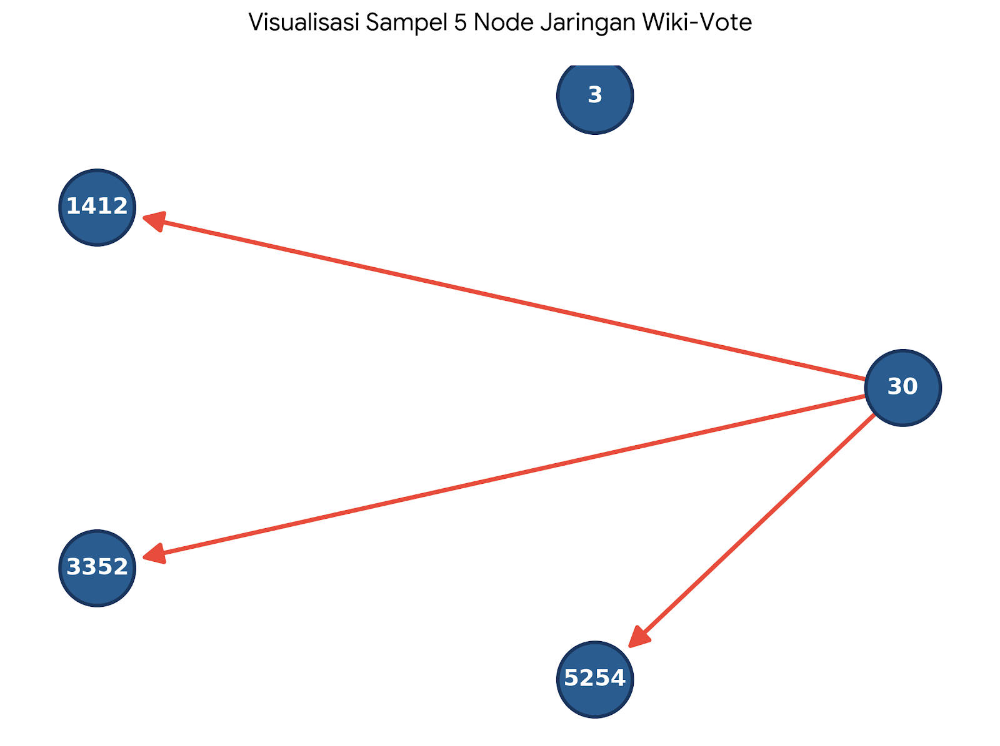

# UAS-Analisis-Jejaring-Sosial
Tugas UAS Untara

## Biodata :
- Nama : Graciela Christy Nunuela
- NIM : 2211310028
- Prodi : Teknologi Informasi
- Dataset : `wiki-Vote.txt.gz`

## Deskripsi Repository
Repository ini berisi berkas analisis Social Network Analysis (SNA) menggunakan dataset Wiki-Vote dari Stanford SNAP.

## 1. Gambarkan dan jelaskan representasi graf dari jejaring yang digunakan. Tentukan jenis graf (berarah/tak berarah dan berbobot/tidak berbobot), kemudian buat contoh matriks adjacency dari minimal lima node.
- Representasi :
- a. Dataset : wiki-vote dari Stanford SNAP Repository yang merepresentasikan jaringan pemungutan suara
- b. Node : 7.155 dan 1103.689 Edge
- Jenis Graff : Graff berarah dan Graff tidak berbobot
Gambar :
  
  
## 2. Hitung dan analisis Degree Centrality, Betweenness Centrality, Closeness Centrality, dan Eigenvector Centrality. Jelaskan peran node yang memiliki nilai tertinggi pada masing-masing metrik.

## 3. Hitung Density, Diameter, Average Path Length, dan Clustering Coefficient. Selanjutnya lakukan deteksi komunitas menggunakan algoritma Louvain atau Girvan-Newman, kemudian interpretasikan hasilnya terhadap struktur jaringan.

## 4. Lakukan simulasi penyebaran informasi menggunakan konsep propagasi informasi atau model epidemi sederhana. Analisis pengaruh node penting terhadap kecepatan penyebaran informasi pada jaringan.

## 5. Visualisasikan jejaring menggunakan Gephi atau NetworkX, kemudian simpulkan karakteristik jaringan berdasarkan seluruh hasil analisis.
